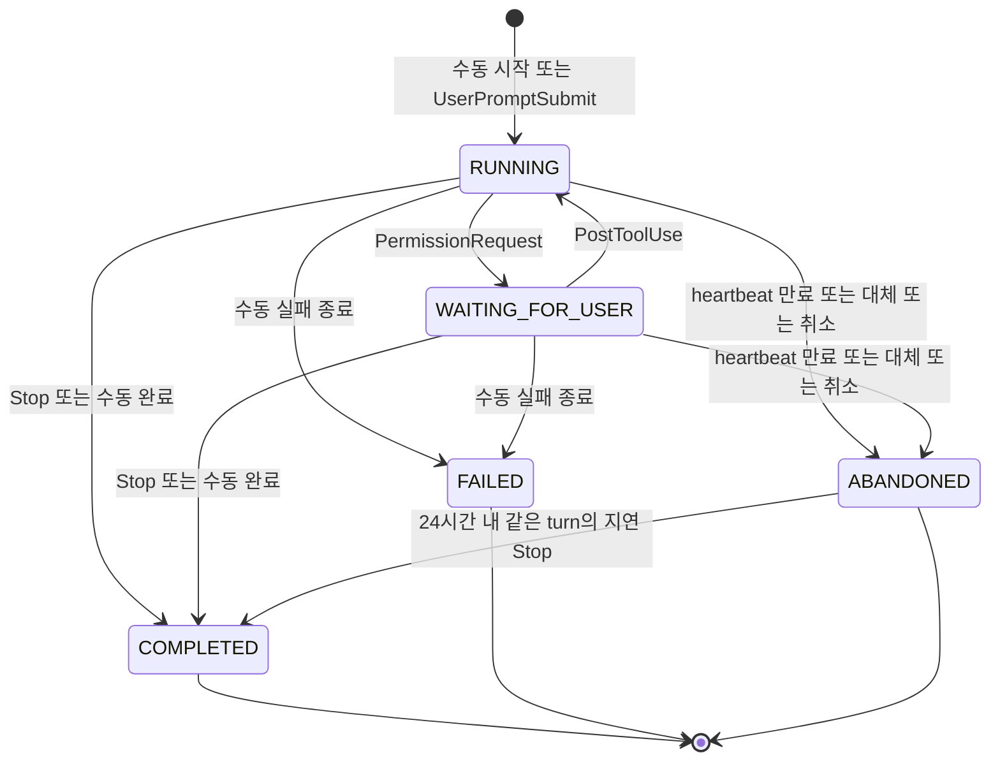
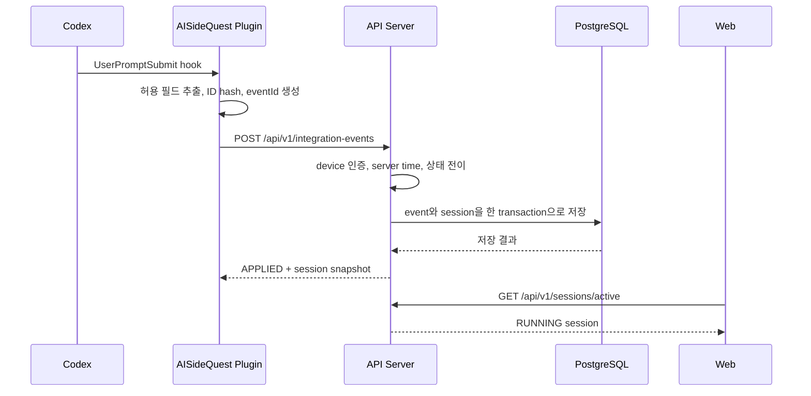
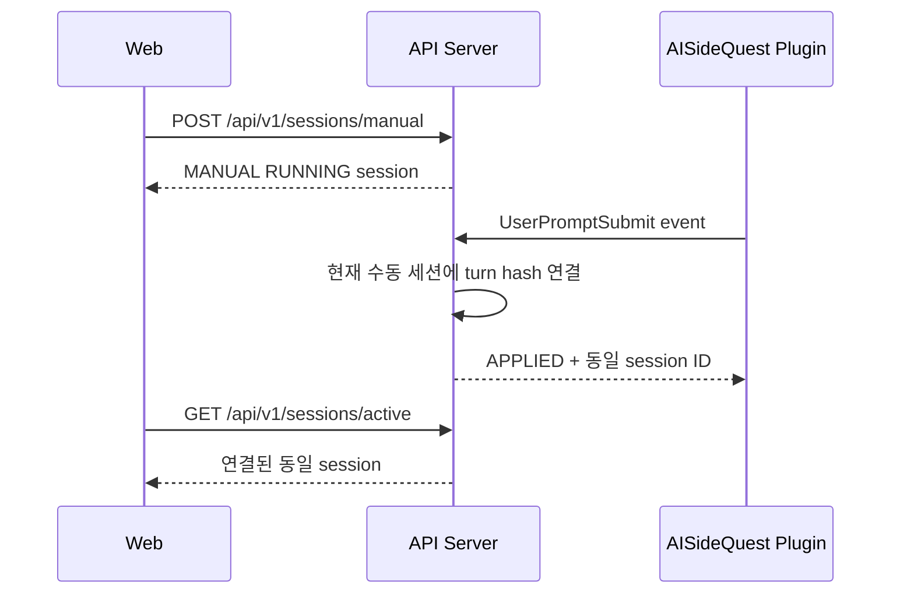

# AISideQuest 세션 상태와 데이터 흐름 설계

- 설계일: 2026-07-15
- 대상: Windows ChatGPT 데스크톱 앱의 Codex 작업
- 상태: **설계 확정 / 7번 API 구현 완료**
- 선행 작업: [`AUTO_DETECTION_POC.md`](./AUTO_DETECTION_POC.md)

---

# 1. 목적

Codex hook 자동 감지와 웹의 수동 시작·종료가 하나의 세션 기록으로 일관되게 처리되도록 다음 계약을 확정한다.

1. 세션 상태와 전이 조건
2. 자동 감지와 수동 조작의 충돌 규칙
3. 중복, 역순, 누락, 네트워크 단절, 앱 종료 처리
4. Codex 플러그인, API 서버, 웹의 책임
5. AI 세션 및 integration event API 계약

이 문서는 3번 설계 작업과 7번 AI 세션 API 구현의 기준 문서다. NestJS 구현은 `server/src/sessions/`, 멱등성 추가 migration은 `1784167200000-add-session-api-idempotency`에 있다.

# 2. 핵심 결정

| 항목 | 결정 |
|---|---|
| 세션 단위 | Codex thread 전체가 아닌 사용자 요청 1회에 대응하는 turn 1개 |
| 활성 세션 수 | 베타에서는 사용자당 최대 1개 |
| 상태 소유자 | API 서버 |
| 기준 시각 | API 서버의 event 수신 시각 |
| 자동 시작 | `UserPromptSubmit` |
| 사용자 확인 대기 | `PermissionRequest` |
| 실행 복귀 | `PostToolUse` |
| 자동 완료 | 같은 turn의 `Stop` |
| 자동 heartbeat | 30초 간격 |
| 자동 세션 만료 | 마지막 유효 event 또는 heartbeat 이후 120초 |
| 순수 수동 세션 만료 | 시작 후 12시간 |
| 웹 동기화 | 활성 탭에서 5초 polling, 창 focus 시 즉시 갱신 |
| 실시간 기술 | 베타에서는 WebSocket과 SSE를 사용하지 않음 |
| 시간 산정 | `endedAt - startedAt`; 권한 승인 대기 시간 포함 |
| 금지 데이터 | 프롬프트, 응답, transcript, 소스 코드, 파일 경로, 명령 및 도구 입출력 |

한 사용자가 여러 Codex turn을 동시에 추적하는 기능은 베타 범위에서 제외한다. 새 turn이 시작되면 기존 자동 세션은 `ABANDONED`로 정리하고 최신 turn만 활성 상태로 유지한다.

# 3. 세션 상태

## 3.1 상태 정의

| 상태 | 의미 | `endedAt` | 활성 상태 |
|---|---|---|---|
| `RUNNING` | Codex가 작업 중이거나 수동 추적이 진행 중 | `null` | 예 |
| `WAITING_FOR_USER` | Codex가 권한 승인 등 사용자 입력을 기다리는 것으로 감지됨 | `null` | 예 |
| `COMPLETED` | hook `Stop` 또는 사용자 완료로 정상 종료 | 필수 | 아니요 |
| `FAILED` | 사용자가 작업 실패로 명시적으로 종료 | 필수 | 아니요 |
| `ABANDONED` | heartbeat 만료, 새 turn에 의한 대체, 사용자 취소 또는 안전 만료 | 필수 | 아니요 |

현재 Codex hook에는 작업 실패만을 명확히 나타내는 event가 없으므로 `FAILED`는 자동 추론하지 않는다. 최초 베타에서는 사용자가 수동 종료할 때 실패 결과를 선택한 경우에만 사용한다.

## 3.2 상태 불변 조건

- 한 사용자에게 `RUNNING` 또는 `WAITING_FOR_USER` 세션은 최대 1개다.
- 활성 상태는 `endedAt = null`, 종료 상태는 `endedAt != null`이다.
- `startedAt`은 생성 후 변경하지 않는다.
- `lastActivityAt`과 `endedAt`은 `startedAt`보다 빠를 수 없다.
- 세션 시간은 저장된 누적 숫자가 아니라 `max(0, endedAt 또는 현재 서버 시각 - startedAt)`으로 계산한다.
- `(userId, provider, externalTurnKey)`는 중복될 수 없다.
- 동일한 event 재전송은 상태와 시각을 다시 변경하지 않는다.
- `COMPLETED`와 `FAILED`는 변경하지 않는다.
- `ABANDONED`는 같은 turn의 지연된 `Stop`이 24시간 안에 도착한 경우에만 `COMPLETED`로 정정할 수 있다. 이때 기존 `endedAt`은 유지하고 시간 품질을 `DEGRADED`로 표시한다.

## 3.3 상태 전이도



`ABANDONED → COMPLETED`는 세션을 다시 활성화하는 전이가 아니라 지연 event에 의한 종료 결과 정정이다.

# 4. Codex event 매핑

Codex 공식 hook은 turn 범위 event에 `turn_id`를 제공하고, 플러그인 hook에는 쓰기 가능한 `PLUGIN_DATA`를 제공한다. 플러그인은 원본 식별자를 서버로 보내지 않고 기존 PoC와 동일하게 SHA-256 hash로 변환한다.

| Hook 또는 내부 event | 대상 상태 | 서버 처리 |
|---|---|---|
| `SessionStart` | 상태 변경 없음 | 연결 상태와 마지막 plugin 활동만 갱신 |
| `UserPromptSubmit` | 없음 → `RUNNING` | turn hash 기준 세션 생성 또는 기존 수동 세션 연결 |
| `PreToolUse` | 현재 상태 유지 | `lastActivityAt`만 갱신 |
| `PermissionRequest` | `RUNNING` → `WAITING_FOR_USER` | 사용자 확인 필요 상태로 변경 |
| `PostToolUse` | `WAITING_FOR_USER` → `RUNNING` | 실행 복귀로 처리. 이미 `RUNNING`이면 시각만 갱신 |
| `Stop` | 활성 → `COMPLETED` | 같은 turn만 정상 완료 처리 |
| `Heartbeat` | 현재 상태 유지 | 플러그인이 생성하는 내부 event로 `lastActivityAt` 갱신 |

`PermissionRequest` 이후 승인 완료 전용 hook은 없다. 따라서 실제 승인 직후가 아니라 `PostToolUse` 수신 시점에 `RUNNING`으로 돌아가며, 전체 세션 시간에는 사용자 승인 대기가 포함된다.

공식 근거:

- [Codex hooks](https://learn.chatgpt.com/docs/hooks)
- [Build Codex plugins](https://learn.chatgpt.com/docs/build-plugins)

# 5. 자동 감지와 수동 조작 충돌 규칙

| 현재 상황 | 새 입력 | 처리 결과 |
|---|---|---|
| 활성 세션 없음 | 수동 시작 | `origin=MANUAL`인 `RUNNING` 생성 |
| 활성 세션 없음 | `UserPromptSubmit` | `origin=HOOK`인 `RUNNING` 생성 |
| 연결되지 않은 수동 세션 활성 | `UserPromptSubmit` | 새 세션을 만들지 않고 현재 세션에 turn hash를 연결. 수동 `startedAt` 유지 |
| 자동 연결 세션 활성 | 수동 시작 | 새 세션을 만들지 않고 현재 활성 세션 반환 |
| 같은 turn 활성 | 중복 `UserPromptSubmit` | 상태와 `startedAt` 유지, 중복 처리 결과 반환 |
| 다른 turn 활성 | 새 `UserPromptSubmit` | 기존 세션을 `ABANDONED/SUPERSEDED_BY_NEW_TURN`으로 종료한 후 새 세션 생성 |
| 자동 연결 세션 활성 | 수동 완료·실패·취소 | 사용자 요청대로 즉시 종료. 이후 같은 turn event는 중복 또는 지연 event로 기록 |
| 수동 세션 활성 | 같은 turn의 `Stop` | 연결된 세션을 `COMPLETED`로 종료 |
| 종료 세션 | 수동 종료 재요청 | 기존 결과 반환, 상태와 시각 변경 없음 |

수동 세션에 자동 turn을 연결하는 규칙은 최초 지원 도구가 Codex 하나이고 사용자당 활성 세션이 하나라는 베타 제약에서만 사용한다. 지원 도구 또는 동시 활성 세션을 늘릴 때는 명시적인 대상 선택 기능이 필요하다.

# 6. 예외 및 복구 규칙

## 6.1 중복 event

두 단계로 중복을 방어한다.

1. 전송 중복: `(deviceId, eventId)` unique key로 같은 요청을 한 번만 처리한다.
2. 의미 중복: `(userId, provider, externalTurnKey)`와 현재 상태를 확인해 event ID가 달라도 같은 시작·종료를 반복 적용하지 않는다.

`PreToolUse`, `PostToolUse`, `Heartbeat`는 한 turn에서 여러 번 발생할 수 있으므로 event명만으로 중복 판단하지 않는다.

## 6.2 역순 event

- 시작 전 `PermissionRequest`, `PostToolUse`, `Stop`을 받으면 세션을 추측해 생성하지 않고 integration event를 `DEFERRED`로 저장한다.
- 같은 turn의 `UserPromptSubmit`이 24시간 안에 도착하면 시작을 먼저 적용한 후 보류 event를 재처리한다.
- 보류된 `Stop`의 서버 수신 시각이 시작 수신 시각보다 빠르면 `endedAt = startedAt`으로 보정하고 `timingQuality=DEGRADED`로 표시한다.
- 24시간 안에 시작 event가 오지 않으면 `IGNORED_ORPHAN`으로 종료한다.

클라이언트의 `observedAt`은 문제 분석과 재전송 순서 확인에만 사용하며 세션 시작·종료 시각으로 신뢰하지 않는다. 서버 수신 시각보다 5분을 초과해 미래인 값은 `VALIDATION_ERROR`로 거부한다.

## 6.3 heartbeat 만료

- 자동 연결 세션은 30초마다 heartbeat를 전송한다.
- `lastActivityAt` 이후 120초 동안 hook event와 heartbeat가 모두 없으면 `ABANDONED/HEARTBEAT_TIMEOUT`으로 종료한다.
- 만료 작업이 늦게 실행돼도 `endedAt`은 작업 실행 시각이 아니라 `lastActivityAt + 120초`로 기록한다.
- `WAITING_FOR_USER`에서도 플러그인이 실행 중이면 heartbeat를 계속 보내므로 사용자 승인 시간이 길다는 이유만으로 종료하지 않는다.
- 자동 turn에 연결되지 않은 순수 수동 세션은 heartbeat 대상이 아니며 시작 후 12시간이 지나면 `ABANDONED/MANUAL_TIMEOUT`으로 정리한다.

## 6.4 네트워크 단절과 앱 종료

- 플러그인은 event를 로컬 queue에 보관하고 동일 `eventId`로 재전송한다.
- 서버는 event가 오지 않는 동안 상태를 추측해 `COMPLETED`로 변경하지 않는다.
- heartbeat 만료 시 `ABANDONED` 처리한다.
- 같은 turn의 `Stop`이 24시간 안에 지연 도착하면 `COMPLETED/RECOVERED_LATE_STOP`으로 정정하지만 기존 종료 시각은 유지한다.
- 24시간 이후 도착한 event는 기록만 남기고 상태를 변경하지 않는다.

로컬 queue와 재전송 구현은 12번 작업에서 수행한다.

## 6.5 hook 미지원 또는 신뢰 해제

- 서버에 자동 event가 도착하지 않으므로 자동 세션을 생성하지 않는다.
- 웹은 활성 세션이 없을 때 수동 시작 버튼을 제공한다.
- 마지막 plugin 활동 시각이 오래됐으면 `자동 감지 연결 안 됨`을 표시하되 사용자의 Codex 작업 자체를 막지 않는다.

# 7. 데이터 모델 계약

기본 테이블과 인덱스는 5번 작업에서 작성했고, 7번에서 API 멱등성 원장과 integration event 응답 snapshot을 추가했다.

## 7.1 AiSession

| 필드 | 타입 | 규칙 |
|---|---|---|
| `id` | UUID | 서버 생성 |
| `userId` | UUID | 소유 사용자 |
| `provider` | `CODEX` | 최초 베타 고정 |
| `status` | SessionStatus | 5개 상태 중 하나 |
| `origin` | `HOOK \| MANUAL` | 최초 생성 원인, 변경하지 않음 |
| `externalSessionKey` | string 또는 null | Codex session ID의 SHA-256 hash |
| `externalTurnKey` | string 또는 null | Codex turn ID의 SHA-256 hash |
| `startedAt` | timestamptz | 서버 기준, 변경 불가 |
| `endedAt` | timestamptz 또는 null | 활성 상태에서는 null |
| `lastActivityAt` | timestamptz | 마지막으로 적용한 event의 서버 수신 시각 |
| `terminalReason` | enum 또는 null | 종료 원인 |
| `timingQuality` | `EXACT \| DEGRADED` | 역순·복구 시 DEGRADED |
| `version` | integer | 동시 갱신 충돌 방지 |
| `createdAt` | timestamptz | 서버 생성 시각 |
| `updatedAt` | timestamptz | 서버 최종 변경 시각 |

`durationMs`는 저장 필드가 아니라 응답 시 계산한다.

## 7.2 TerminalReason

| 값 | 적용 상태 |
|---|---|
| `HOOK_STOP` | `COMPLETED` |
| `MANUAL_COMPLETED` | `COMPLETED` |
| `MANUAL_FAILED` | `FAILED` |
| `MANUAL_CANCELLED` | `ABANDONED` |
| `HEARTBEAT_TIMEOUT` | `ABANDONED` |
| `MANUAL_TIMEOUT` | `ABANDONED` |
| `SUPERSEDED_BY_NEW_TURN` | `ABANDONED` |
| `RECOVERED_LATE_STOP` | `COMPLETED` |

## 7.3 IntegrationEvent

| 필드 | 타입 | 규칙 |
|---|---|---|
| `eventId` | UUID | 플러그인 생성, 재전송해도 유지 |
| `deviceId` | UUID | 연결된 플러그인 기기 |
| `userId` | UUID | device 연결에서 서버가 결정 |
| `provider` | `CODEX` | 최초 베타 고정 |
| `event` | HookEvent | 허용 목록만 수신 |
| `externalSessionKey` | string | 64자리 소문자 16진수 |
| `externalTurnKey` | string 또는 null | turn event에서는 필수 |
| `observedAt` | ISO 8601 | 클라이언트 참고 시각, 상태 시각으로 사용하지 않음 |
| `receivedAt` | timestamptz | 서버 수신 시각 |
| `processingResult` | enum | `APPLIED`, `DUPLICATE`, `DEFERRED`, `IGNORED_TERMINAL`, `IGNORED_ORPHAN` |

원본 hook JSON은 저장하지 않는다.

# 8. 구성 요소별 책임

| 책임 | Codex 플러그인 | API 서버 | 웹 |
|---|:---:|:---:|:---:|
| hook 감지 | O | X | X |
| 프롬프트·코드 제거 | O | 허용 필드 재검증 | X |
| ID hash | O | 형식 검증 | X |
| device 인증 | token 전송 | 소유 사용자 결정 | cookie 인증 |
| event ID 생성·로컬 queue | O | 중복 방지 | X |
| 세션 상태 전이 | X | O | X |
| 기준 시각 결정 | X | O | X |
| heartbeat 전송·만료 판정 | 전송 | 판정 | X |
| 수동 시작·종료 | X | 명령 처리 | 사용자 입력 전송 |
| 현재 상태 표시 | X | 조회 제공 | O |
| duration 계산 | X | 응답 값 계산 | 진행 중 표시만 현재 시각으로 갱신 |

플러그인과 웹은 세션 상태를 최종 결정하지 않는다. 서버 응답을 받기 전의 낙관적 UI 변경도 하지 않는다.

# 9. 데이터 흐름

## 9.1 자동 감지



## 9.2 수동 시작 후 자동 감지 연결



## 9.3 웹 동기화

- 활성 탭은 5초마다 `GET /api/v1/sessions/active`를 호출한다.
- 창 focus 또는 `visibilitychange`로 다시 활성화되면 즉시 조회한다.
- 모든 정상 API 응답의 `meta.serverTime`으로 브라우저와 서버의 시각 차이를 계산한다.
- 진행 시간 표시는 `startedAt`과 보정된 서버 현재 시각의 차이로 갱신하며, 저장값은 서버가 소유한다.
- 상태 변경 요청 후에는 즉시 활성 세션과 이력을 다시 조회한다.
- 5초보다 빠른 반영이 실제 파일럿에서 필요하다고 확인되기 전까지 WebSocket이나 SSE를 추가하지 않는다.

# 10. API 계약

모든 시각은 ISO 8601 UTC 문자열을 사용한다. 모든 변경 API는 `Idempotency-Key`를 요구한다. 정상 API 응답에는 브라우저 시각 오차 보정을 위한 `meta.serverTime`을 포함한다.

## 10.1 플러그인 event 수신

```http
POST /api/v1/integration-events
Authorization: Bearer <device-token>
Idempotency-Key: <event-id>
Content-Type: application/json
```

```json
{
  "schemaVersion": 1,
  "eventId": "7e72e856-bde5-472b-bbe8-92bcb3c6a846",
  "provider": "CODEX",
  "event": "UserPromptSubmit",
  "sessionKey": "64-character-lowercase-sha256",
  "turnKey": "64-character-lowercase-sha256",
  "observedAt": "2026-07-15T08:30:14.836Z"
}
```

허용 event는 `SessionStart`, `UserPromptSubmit`, `PreToolUse`, `PermissionRequest`, `PostToolUse`, `Stop`, `Heartbeat`다. `SessionStart`만 `turnKey=null`을 허용한다.

```json
{
  "data": {
    "eventId": "7e72e856-bde5-472b-bbe8-92bcb3c6a846",
    "result": "APPLIED",
    "session": {
      "id": "901307cb-0ac2-47ea-b847-1439674cd52d",
      "status": "RUNNING",
      "origin": "HOOK",
      "provider": "CODEX",
      "autoLinked": true,
      "startedAt": "2026-07-15T08:30:15.010Z",
      "endedAt": null,
      "lastActivityAt": "2026-07-15T08:30:15.010Z",
      "durationMs": 0,
      "terminalReason": null,
      "timingQuality": "EXACT",
      "version": 1
    }
  },
  "meta": {
    "serverTime": "2026-07-15T08:30:15.010Z"
  }
}
```

같은 `eventId` 재요청은 최초 처리와 같은 HTTP 상태 및 논리 결과를 반환한다.

## 10.2 수동 시작

```http
POST /api/v1/sessions/manual
Authorization: <user-session-cookie>
Idempotency-Key: <uuid>
```

- 활성 세션이 없으면 `origin=MANUAL`, `status=RUNNING` 세션을 생성한다.
- 이미 활성 세션이 있으면 새로 만들지 않고 기존 세션과 `created=false`를 반환한다.

## 10.3 수동 종료

```http
POST /api/v1/sessions/{sessionId}/end
Authorization: <user-session-cookie>
Idempotency-Key: <uuid>
Content-Type: application/json
```

```json
{
  "outcome": "COMPLETED"
}
```

`outcome`은 `COMPLETED`, `FAILED`, `ABANDONED` 중 하나다. 이미 종료된 세션이면 현재 결과를 그대로 반환한다. 다른 사용자의 세션은 존재 여부를 노출하지 않고 `404`로 응답한다.

## 10.4 현재 세션 조회

```http
GET /api/v1/sessions/active
Authorization: <user-session-cookie>
```

활성 세션이 없으면 `404` 대신 다음과 같이 응답한다.

```json
{
  "data": null,
  "meta": {
    "serverTime": "2026-07-15T08:35:00.000Z"
  }
}
```

## 10.5 세션 이력 조회

```http
GET /api/v1/sessions?cursor=<opaque>&limit=20&status=COMPLETED
Authorization: <user-session-cookie>
```

- 기본 `limit`은 20, 최댓값은 100이다.
- 정렬은 `startedAt DESC, id DESC`다.
- offset 대신 opaque cursor를 사용한다.

## 10.6 오류 응답

```json
{
  "error": {
    "code": "INVALID_TRANSITION",
    "message": "현재 상태에서는 요청한 작업을 처리할 수 없습니다."
  }
}
```

| HTTP | 코드 | 조건 |
|---:|---|---|
| 400 | `VALIDATION_ERROR` | 형식, 필수값, hash, 시각 오류 |
| 401 | `AUTH_REQUIRED` | 사용자 인증 없음 |
| 401 | `DEVICE_AUTH_REQUIRED` | device token 없음 또는 만료 |
| 404 | `SESSION_NOT_FOUND` | 세션 없음 또는 소유권 없음 |
| 409 | `INVALID_TRANSITION` | 허용하지 않는 상태 전이 |
| 409 | `IDEMPOTENCY_KEY_REUSED` | 같은 key에 다른 요청 본문 사용 |
| 422 | `UNSUPPORTED_EVENT` | 허용하지 않는 integration event |

# 11. transaction과 동시성 기준

- integration event 저장과 세션 상태 변경은 하나의 DB transaction으로 처리한다.
- 상태 변경 전에 사용자별 활성 세션을 잠그거나 동등한 DB 제약으로 직렬화한다.
- event unique key와 활성 세션 unique 조건은 애플리케이션 검사뿐 아니라 DB에서도 보장한다.
- 동시 수동 시작 두 건은 하나만 생성하고 둘 다 최종 활성 세션을 반환한다.
- 새 자동 turn 처리 중 기존 세션 종료와 새 세션 생성을 한 transaction에서 수행한다.
- 서버가 transaction을 완료하기 전에 실패하면 event를 처리 완료로 응답하지 않는다.

# 12. 현재 MVP에서 변경되는 경계

[`SessionContext.tsx`](../src/contexts/SessionContext.tsx)는 8번 작업에서 다음과 같은 API adapter로 전환했다.

- `SessionContext`는 서버 상태를 조회하고 요청하는 UI adapter가 된다.
- `startSession`과 `endSession`은 API 호출 후 서버 응답으로 상태를 갱신한다.
- `RUNNING`과 `WAITING_FOR_USER`를 모두 활성 세션으로 취급한다.
- `WAITING_FOR_USER`에서는 `Codex 확인 필요` 안내를 표시한다.
- LocalStorage 세션은 9번 전환 화면에서만 검증하고 서버의 권위 있는 상태로 사용하지 않는다.
- 퀘스트 이력은 서버 세션 ID에 연결한다.
- 통계 집계 기준은 16번 작업에서 별도로 확정한다.

5초 polling은 활성 세션만 조회하고, 활성 세션 ID가 바뀌거나 종료되면 cursor 이력도 다시 읽는다. 초기 진입·수동 변경 후에는 전체 cursor 이력을 복구하며 모든 경과 시간은 `meta.serverTime`으로 보정한다.

# 13. 검증 시나리오

7번과 후속 장애 복구 구현은 최소한 다음 시나리오를 자동 테스트한다.

## 13.1 정상 및 경계값

1. 자동 시작 → 도구 사용 → 자동 완료
2. 자동 시작 → 권한 대기 → 실행 복귀 → 완료
3. 수동 시작 → 수동 완료
4. 수동 시작 → 자동 event 연결 → 자동 완료
5. 세션이 없는 현재 세션 조회
6. duration 0인 즉시 종료

## 13.2 중복과 동시성

1. 같은 `eventId` 재전송
2. 다른 `eventId`의 같은 turn 시작 중복
3. 같은 turn `Stop` 중복
4. 동시에 두 번 수동 시작
5. 수동 시작과 자동 시작 동시 요청
6. 기존 turn 실행 중 새 turn 시작

## 13.3 오류와 복구

1. 시작보다 먼저 도착한 `Stop`
2. heartbeat 120초 만료
3. 12시간 지난 순수 수동 세션
4. 만료 후 24시간 안에 도착한 같은 turn의 `Stop`
5. hook 비활성 상태의 수동 모드
6. 잘못된 hash, 빈 turn key, 미래 `observedAt`
7. 다른 사용자 세션 종료 시도
8. 동일 idempotency key에 다른 본문 사용

## 13.4 개인정보

1. 허용되지 않은 필드가 요청에 포함되면 거부 또는 폐기
2. DB event 레코드에 프롬프트, 응답, 경로, 명령이 없는지 확인
3. 원본 session ID와 turn ID가 로그와 오류 응답에 노출되지 않는지 확인

# 14. 완료 판정

- [x] 5개 세션 상태의 의미와 진입·종료 조건 정의
- [x] Codex hook과 상태 전이 매핑
- [x] 자동 감지와 수동 조작의 충돌 규칙 정의
- [x] 중복, 역순, 누락, 네트워크 단절, 앱 종료 처리 정의
- [x] heartbeat 주기와 만료 시각 정의
- [x] 플러그인, 서버, 웹의 책임 분리
- [x] API 요청·응답·오류·멱등성 계약 정의
- [x] 현재 MVP의 후속 변경 경계 정의

결론: **3번 세션 상태와 데이터 흐름 설계 및 7번 AI 세션 API 구현을 완료한다. 다음 작업은 8번 프런트엔드 세션 상태의 API 전환이다.**

---

# 15. 7번 구현 결과

## 15.1 구현 API

| Method | Path | 인증 | 구현 결과 |
|---|---|---|---|
| `POST` | `/api/v1/sessions/manual` | 사용자 cookie + CSRF | 활성 세션 생성 또는 기존 세션 반환 |
| `POST` | `/api/v1/sessions/{sessionId}/end` | 사용자 cookie + CSRF | 완료·실패·취소 종료, terminal 재요청 무변경 |
| `GET` | `/api/v1/sessions/active` | 사용자 cookie | 활성 세션 또는 `data: null` |
| `GET` | `/api/v1/sessions` | 사용자 cookie | 상태 필터와 opaque cursor 이력 |
| `POST` | `/api/v1/integration-events` | device bearer token | Codex event 저장과 상태 전이 transaction |

## 15.2 멱등성과 동시성

- 모든 웹 변경 요청은 UUID 형식 `Idempotency-Key`를 요구한다.
- 사용자와 idempotency key 조합으로 request hash와 최초 응답 body를 저장한다.
- 같은 key와 같은 요청은 저장된 응답을 반환한다.
- 같은 key를 다른 endpoint, session 또는 outcome에 재사용하면 `IDEMPOTENCY_KEY_REUSED`를 반환한다.
- 사용자별 `pg_advisory_xact_lock`으로 수동 요청과 integration event를 직렬화한다.
- DB의 사용자별 활성 세션 unique index를 최종 방어선으로 유지한다.
- integration event는 `(device_id, event_id)` unique key와 request hash를 함께 검증한다.

## 15.3 구현된 상태 처리

- 수동 시작과 `UserPromptSubmit` 시작
- 수동 세션에 자동 turn 연결
- 같은 turn의 의미 중복 시작 차단
- 다른 turn 시작 시 기존 활성 세션 `ABANDONED/SUPERSEDED_BY_NEW_TURN` 처리
- `PermissionRequest` 대기, `PostToolUse` 실행 복귀, `Stop` 완료
- 시작보다 먼저 도착한 event `DEFERRED` 저장
- 24시간 안에 시작이 도착한 역순 event 재처리
- 역순 `Stop`의 0ms 종료와 `DEGRADED` 품질 표시
- 종료 세션 재요청 시 기존 terminal 상태 유지

## 15.4 다음 작업에 남긴 경계

- 기기 token을 발급하는 웹 연결 코드와 회전·해제는 10번에서 구현한다.
- plugin의 실제 event 전송 연결은 11번에서 구현한다.
- heartbeat 만료 스캔, 수동 12시간 만료, 오프라인 durable queue와 재전송은 12번에서 구현했다.
- React `SessionContext`의 API 연결은 8번에서 구현한다.
