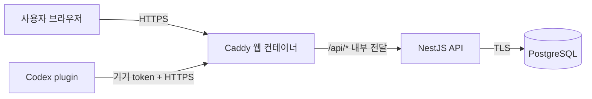

# 운영 배포 가이드

이 문서는 운영자가 배포 순서를 빠르게 확인하기 위한 안내입니다. 세부 명령과 중단 조건은 [`ai/DEPLOYMENT_AND_PILOT.md`](./ai/DEPLOYMENT_AND_PILOT.md)를 기준으로 합니다.

> AISideQuest의 기본 제품 경로는 개발자 개인 PC의 무료 로컬 실행입니다. 이 문서는 팀 공유 서버나 공개 서비스가 별도로 필요할 때만 사용하는 선택적 절차이며, 기본 사용을 위해 배포할 필요는 없습니다.

## 배포 구조



- staging과 production은 domain, DB, OAuth App, secret을 모두 분리합니다.
- staging에서 검증한 API·웹 image digest를 production에 그대로 승격합니다.
- API는 외부 port를 열지 않고 Caddy만 80/443을 공개합니다.
- 실제 secret은 저장소나 이미지에 넣지 않습니다.

## 배포 전 준비

- [ ] DNS가 배포 host를 가리킴
- [ ] 80/443 inbound 허용
- [ ] 환경별 PostgreSQL과 최소권한 계정 준비
- [ ] 환경별 GitHub OAuth App 준비
- [ ] callback이 `https://<host>/api/v1/auth/github/callback`과 정확히 일치
- [ ] 24시간 이내 backup 증거 준비
- [ ] production은 30일 이내 restore 훈련 증거 준비
- [ ] image가 tag가 아닌 `@sha256:` digest로 고정됨

## 고정 배포 순서

```text
환경 검증
  → backup·restore 증거 확인
  → image pull
  → one-shot migration
  → API readiness
  → 웹 기동
  → HTTPS·CORS·OAuth·SPA smoke
  → release state 기록
```

staging 예시:

```powershell
.\scripts\deploy-release.ps1 `
  -Environment staging `
  -EnvironmentFile C:\secure\aisidequest\staging.env `
  -PublicOrigin https://staging.example.com `
  -BackupEvidence C:\secure\evidence\staging-backup.json
```

## 배포 중단 조건

- migration 실패
- readiness가 `200`이 아님
- HTTPS 또는 HSTS 누락
- 다른 origin이 CORS에서 허용됨
- OAuth callback, state, PKCE, Secure cookie 이상
- SPA 또는 핵심 API smoke 실패

DB migration 실패 시 기존 서비스를 그대로 유지합니다. DB schema는 down migration으로 되돌리지 않고 새 migration으로 forward-fix합니다.

## 애플리케이션 rollback

```powershell
.\scripts\rollback-release.ps1 `
  -Environment production `
  -EnvironmentFile C:\secure\aisidequest\production.env `
  -PublicOrigin https://app.example.com
```

rollback은 직전 API·웹 image digest만 복구합니다. DB schema는 되돌리지 않습니다.

## 파일럿 완료 기준

| 기준 | 목표 |
|---|---:|
| 초대 사용자 전체 흐름 완료 | 10명 이상 |
| 관찰 기간 | 7일 이상 |
| 자동 session | 50건 조기 점검, 100건 최종 표본 |
| 자동 감지 성공률 | 95% 이상 |
| 상태 반영 지연 | p95 5초 이하 |
| 복구 불가 session 유실 | 0건 |
| 중복 session·포인트 | 0건 |
| API 5xx | 1% 미만 |
| 금지 데이터 전송 | 0건 |

실제 infrastructure와 사용자 표본이 충족되기 전에는 20번 전체를 완료로 표시하지 않습니다.
