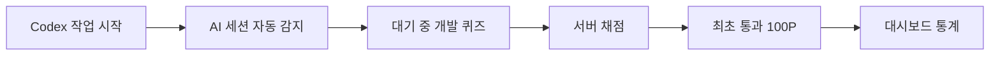

# AISideQuest 프로젝트 소개

> AI가 일하는 동안, 사람도 의미 있는 일을 할 수 있도록.

AISideQuest는 AI 코딩 에이전트를 사용하는 개발자가 자신의 PC에서 무료로 실행하며, 작업 대기 시간을 짧은 개발 퀴즈와 학습 활동으로 바꾸는 로컬 우선 도구입니다.

## 해결하려는 문제

AI가 개발 속도를 높였지만, 사용자는 작업이 끝날 때까지 몇 초에서 몇 분씩 기다리게 됩니다. 한 번은 짧아도 하루 동안 반복되면 상당한 시간이 됩니다.

AISideQuest는 이 시간을 다음 흐름으로 활용합니다.

## 현재 제공하는 기능

| 영역 | 기능 |
|---|---|
| AI 작업 감지 | Codex lifecycle hook, 30초 heartbeat, 수동 시작·종료 fallback |
| 장애 복구 | durable JSONL queue, FIFO 재전송, backoff, late `Stop` 복구 |
| 개발 퀴즈 | 게시 퀘스트 목록, 답안 저장, 새로고침 복구, 서버 채점 |
| 포인트 | 사용자·퀘스트 버전별 최초 통과 시 100P, 잔액과 원장 이력 |
| 통계 | 오늘·주·월·직접 선택 기간의 AI 작업 시간, 퀘스트, 포인트 |
| 개인정보 | 데이터 내보내기·계정 삭제, prompt·응답·코드·경로 비수집 |

## 기본 사용 범위

- 저장소를 내려받아 로컬 서버를 실행할 수 있는 개발자
- Windows 11과 Codex 데스크톱 앱
- GitHub 계정 로그인
- 개인 PC의 PostgreSQL·API·웹
- 객관식 개발 퀴즈 5종
- 현금 가치가 없고 환전·양도할 수 없는 서비스 포인트
- 한국어 웹 화면

## 기술 구성

| 구분 | 기술 |
|---|---|
| 웹 | React 19, TypeScript, Vite, Tailwind CSS |
| API | Node.js 22, NestJS 11 |
| 데이터베이스 | PostgreSQL 16, TypeORM migration |
| 플러그인 | Codex lifecycle hook, Node.js worker |
| 실행 | Docker Compose 기반 로컬 PostgreSQL, 통합 개발 명령 |
| 선택적 운영 | Caddy, GitHub Actions, Prometheus 지표 |

프로젝트를 실행하려면 [개발 및 실행 가이드](./개발_실행_가이드.md), 실제 사용 흐름은 [사용자 가이드](./사용자_가이드.md)를 확인하세요.
