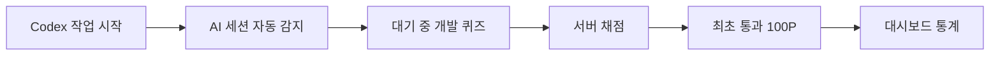

# AISideQuest 프로젝트 소개

> AI가 일하는 동안, 사람도 의미 있는 일을 할 수 있도록.

AISideQuest는 AI 코딩 에이전트를 사용하는 개발자가 자신의 PC에서 무료로 실행하며, 작업 대기 시간을 짧은 개발 퀴즈와 외부 개발 기회 탐색으로 바꾸는 로컬 우선 도구입니다.

## 해결하려는 문제

AI가 개발 속도를 높였지만, 사용자는 작업이 끝날 때까지 몇 초에서 몇 분씩 기다리게 됩니다. 한 번은 짧아도 하루 동안 반복되면 상당한 시간이 됩니다.

AISideQuest는 이 시간을 다음 흐름으로 활용합니다.

## 현재 제공하는 기능

| 영역 | 기능 |
|---|---|
| AI 작업 감지 | Codex lifecycle hook, 30초 heartbeat, 정제된 프로젝트명·명령 분류 표시, 수동 fallback |
| 장애 복구 | durable JSONL queue, FIFO 재전송, backoff, late `Stop` 복구 |
| 개발 퀴즈 | 게시 퀘스트 목록, 답안 저장, 새로고침 복구, 서버 채점 |
| 포인트 | 사용자·퀘스트 버전별 최초 통과 시 100P, 잔액과 원장 이력 |
| 통계 | 오늘·주·월·직접 선택 기간의 AI 작업 시간, 퀘스트, 포인트 |
| Discover | 원격 채용·계약 기회, 개발 소식, 커뮤니티 항목, 사용자별 저장과 명시적 관심 기술 정렬 |
| 개인정보 | 데이터 내보내기·계정 삭제, prompt·응답·코드·전체 경로·원본 명령 비수집 |

## 기본 사용 범위

- 저장소를 내려받아 로컬 서버를 실행할 수 있는 개발자
- Windows 11과 Codex 데스크톱 앱
- GitHub 계정 로그인
- 개인 PC의 PostgreSQL·API·웹
- 객관식 개발 퀴즈 5종
- 현금 가치가 없고 환전·양도할 수 없는 서비스 포인트
- 한국어 웹 화면

## Discover 현황과 다음 단계

Discover는 외부 채용·계약 기회, 개발 소식과 커뮤니티 주제를 정제해 원문으로 연결하는 확장입니다. Hacker News·Remotive·DEV Community·Stack Overflow source, 인증된 API, `/discover`의 세 category tab, 사용자별 저장과 명시적 관심 기술 정렬을 제공합니다. DEV 개발 글은 source가 제공한 예상 읽기 시간과 반응 수를 함께 표시하고, Stack Overflow active bounty는 현금이 아닌 평판 보상으로만 구분합니다.

- 기존 GitHub login은 요구하지만 active AI session은 요구하지 않습니다.
- AISideQuest는 채용, 수익, bounty 자격이나 지급을 보장하지 않습니다.
- 채용 급여, 검증된 cash bounty, reputation bounty와 AISideQuest 100P를 서로 다른 개념으로 표시합니다.
- 외부 item을 조회·저장하거나 원문으로 이동해도 AISideQuest point를 지급하지 않습니다. 저장 snapshot은 source 장애 중에도 조회할 수 있습니다.
- 사용자가 20개 고정 목록에서 직접 선택한 관심 기술을 최대 10개 저장하며, 관심 tag 일치·상대 최신성·source 반응도·보상 정보 명확성으로 결정적으로 정렬합니다. 선택하지 않으면 기존 최신순입니다.
- Prompt, AI 응답, code, diff, transcript, 전체 경로, raw command와 tool input/output는 추천이나 분석에 사용하지 않습니다.
- 저장 snapshot, 관심 기술과 만료 전 Discover analytics는 사용자 data export schema version 4와 계정 삭제에 포함됩니다.

구현 순서는 [Discover 개발 계획](./Discover_개발_계획.md)을 따릅니다.

## 기술 구성

| 구분 | 기술 |
|---|---|
| 웹 | React 19, TypeScript, Vite, Tailwind CSS |
| API | Node.js 22, NestJS 11 |
| 데이터베이스 | PostgreSQL 16, TypeORM migration |
| 플러그인 | Codex lifecycle hook, Node.js worker |
| 실행 | Docker Compose 기반 로컬 PostgreSQL, 통합 개발 명령 |
| 선택적 운영 | Caddy, GitHub Actions, Prometheus 지표 |

프로젝트를 실행하려면 [개발 및 실행 가이드](./개발_실행_가이드.md), 실제 사용 흐름은 [사용자 가이드](./사용자_가이드.md)를 확인하세요.
